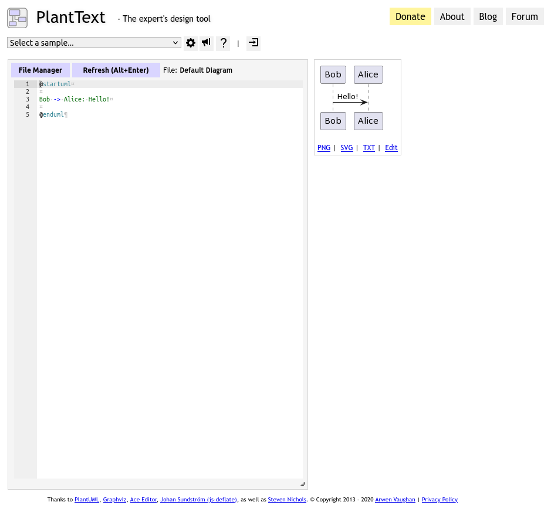

# diagrams folder

You are expected to place your entity relationship diagram here. You can submit either:

- `implementation.puml` if you used PlantUML.
- `implementation.pdf` or `implementation.png` if you exported it from a different tool.

## How to use PlantUML

### File format

The files for PlantUML are regular text files, which are saved as either `.plantuml` or `.puml`.

### Possible ways to install PlantUML

- [Visual Code Extension](https://marketplace.visualstudio.com/items?itemName=jebbs.plantuml)

  You can also find it via the extensions tab in VSCode.

  

- [Online editor](https://www.planttext.com/)

  

### Basic syntax

The diagram lives within the diagram definition. The diagram should be named.

```puml
@startuml some-diagram-name-here

' this is a comment.

@enduml
```

You can modify the look of the PlantUML diagram with CSS. More often than not, you want just simple tweaks:

```puml
hide circle ' hides the circle next to the entity

skinparam Linetype ortho ' produces only orthogonal lines in the diagram

skinparam Nodesep 50 ' sets a minimal value of entity separation on the x-axis.
' The value 50 is arbitrary and should be set according to the diagram

skinparam Ranskep 50 ' sets a minimal value of entity separation on the y-axis.
```

Entity definition, following the syntax `field: data type`

```puml
entity EntityName {
  ' here we define a primary key!
  ' the "*" means that the field is mandatory
  * id: uuid <<PK>>
  ' the following line denotes the end of the primary key
  ---
  * some_field: number
  some_optional_field: string
}
```

The `data type` is entirely up to you to define. The only rule we wish to enforce is: **stay consistent**!

Relationships:

```puml
' optional
Entity ||..o| SomeOptionalEntity

' loose relationship
EntityOne |o..o| EntityTwo

' one to many (without and with required relationship)
Entity ||..o{ OtherEntity ' zero or more of OtherEntity

Entity ||..|{ OtherEntity ' one or more of OtherEntity

' LOGICAL ERD many to many
Entity }|..|{ OtherEntity

' there can also be zeros (letter "o") instead of ones ("|" character)
Entity }o..o{ OtherEntity

' PHYSICAL ERD many to many should be modelled appropriately
' with a join table
```
